# 스프링 부트 데브 옵스 설정법

1. AZure로 일단 DevOps부터 만들자

2. 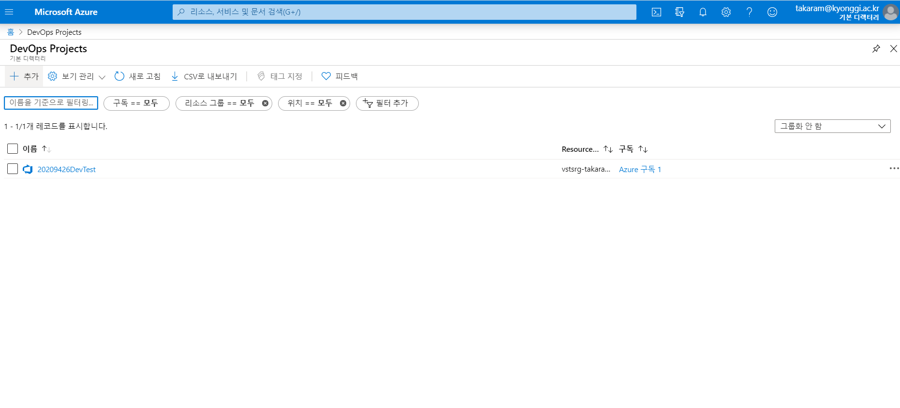

3. 그리고 Java를 선택해서 Spring으로 진행

4. 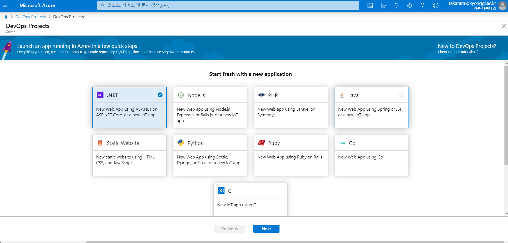

   

5. 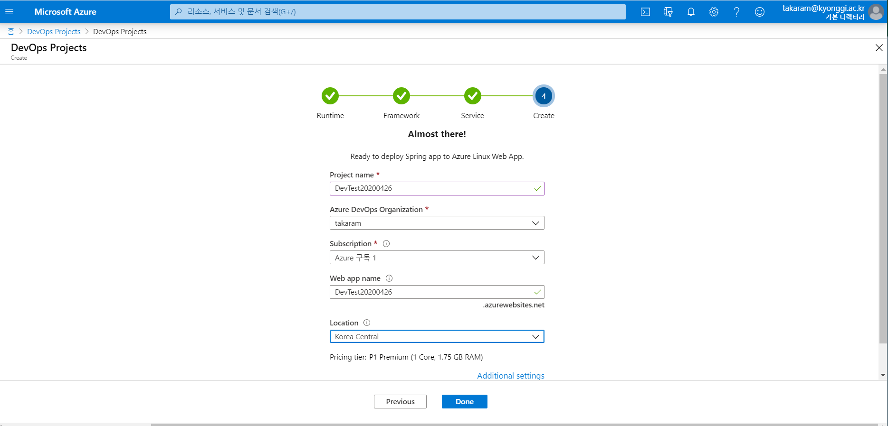

6. 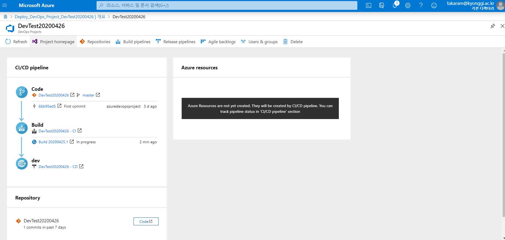

   프로젝트 홈페이지로 간다

7. 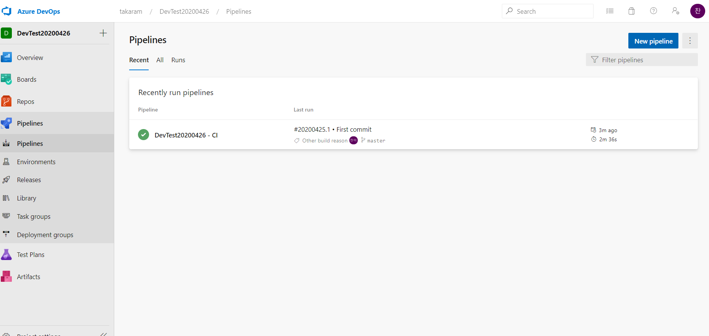

8. 새로운 파이프 라인 생성으로 가서

9. 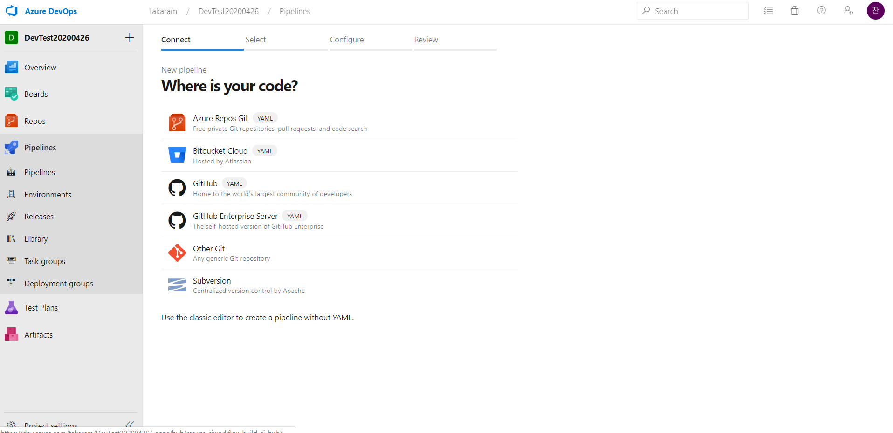

10. Use the classic Editor 클릭

11. 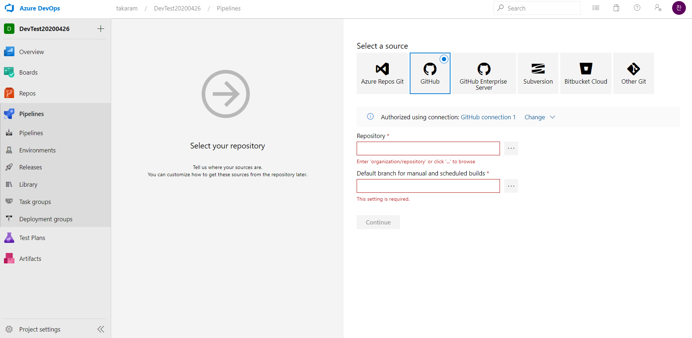

12. 이것들 중에 좋을 대로 선택. 난 깃으로 하기 위해 깃을 선택했다

13. 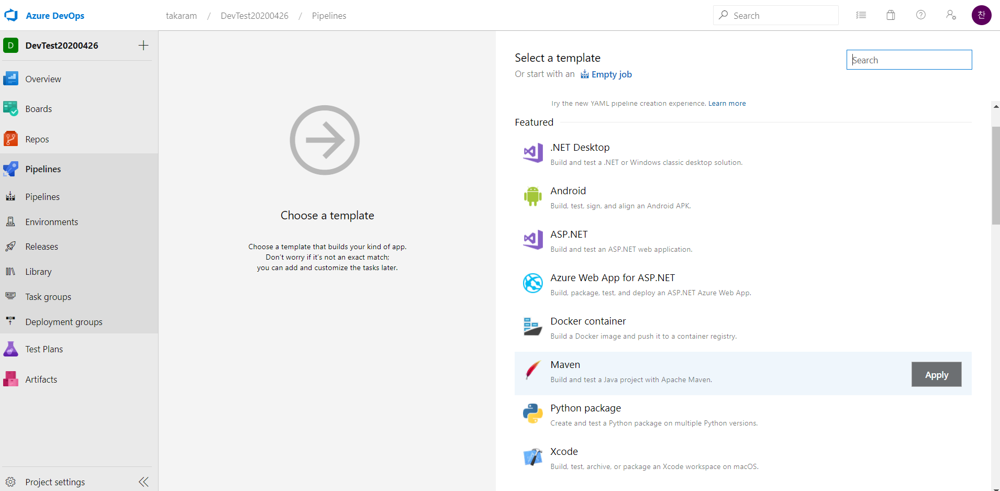

14. 그리고 스프링이기 때문에 Maven 클릭

15. 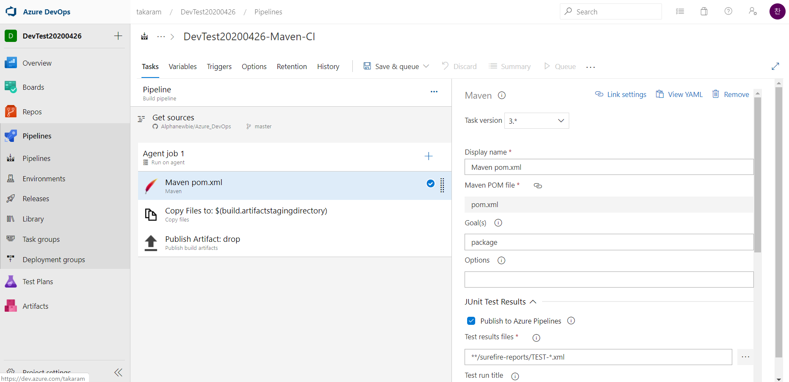

16. 설정은 마음대로 정한다.

    1. Maven Pom은 아마 건드릴것이 Code coverage Tool만 난 이것도 안 건드림

    2. Copy File은 무슨 형식으로 생성할 것인지, Jar이나 War로 나중에 이걸로 빌드한다.

    3. 마지막은 어디에 생성할것인지 정한다. 즉, drop폴터에 생성된다는 뜻

    4. 그리고 Save&Queue로 저장

    5. 가끔 이런 에러가 뜬다

    6. 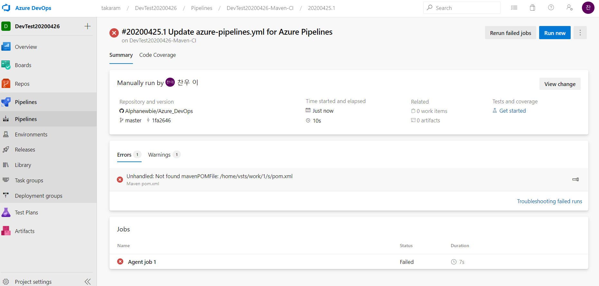

       Maven File을 못 찾았다는 뜻이다. 나의 경우엔 Git에 있으니 깃을 찾아보자

       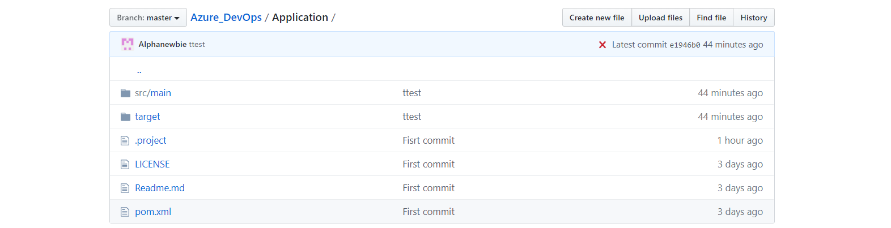

       보면 Application 하위의 pom.xml에 있다.

       Edit pipline으로 가서

       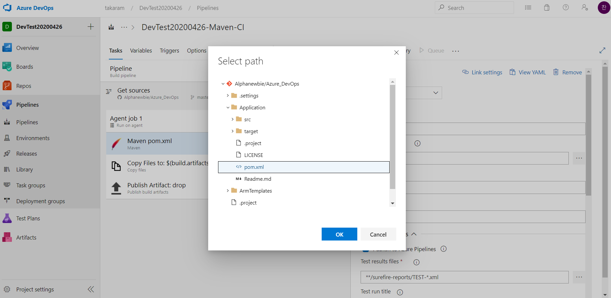

       Pox.xml의 경로를 바꿔준다.

17. 그럼 이제 배포할 차례, release PipeLine으로 가서 새로운 파이프 라인을 만든다

18. 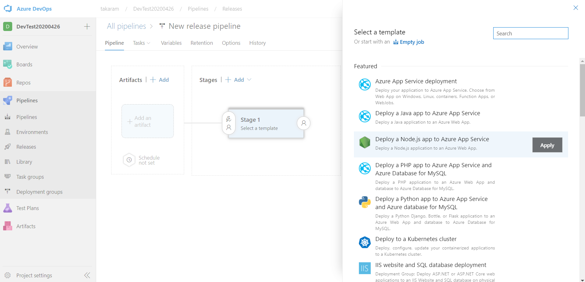

19. 이중에서 Deploy a Java app to Azure App Service을 선택한다.

20. 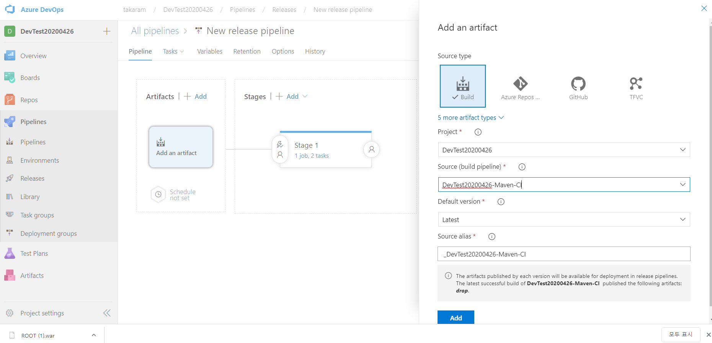

21. 그리고 Azure로 가서 DevOps테스트할 WebApp을 만들어준다.

22. 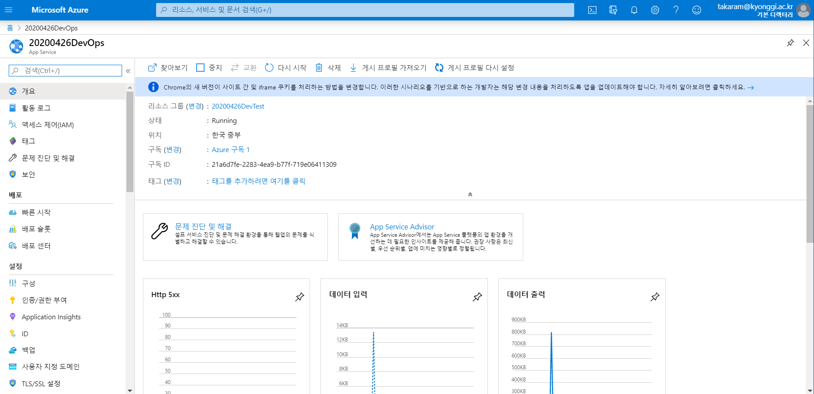

23. 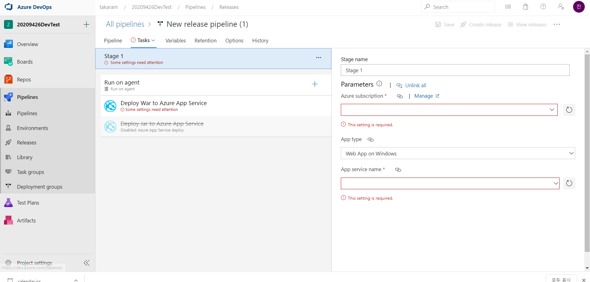

24. 순서대로 Web앱을 가지고 있는 서브 스크립션을 넣어주고

25. 아래의 빨간 줄에는 WebApp의 이름을 기입한다.

26. 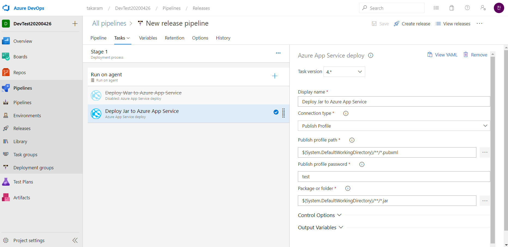

27. 그리고 Jar의 파일을 선택한다.

    1. 난 위의 Jar의 파일이 너무 많이 생겨서 War나중에 war로 파일로 생성하는 걸로 했는데...
    2. 동기화가 안되는 문제가 생겼다.
    3. 온갖 방법을 다 시도해 봐도 war이 최신 버전으로 갱신되지 않는 문제였다...

28. 자동 배포를 켜주면, 업로드 될때마다 배포 완료

29. 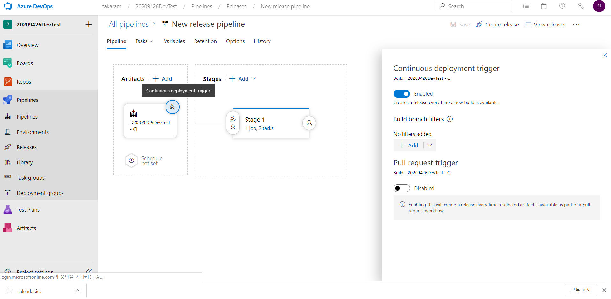